# CREMA° — Arquitetura Técnica & Guia de Engenharia

> **Atlas Vivo do Café** — Da Botânica à Neurociência, das Séries Temporais ao Terminal em Tempo Real.

---

## 1. Visão Geral

O projeto **CREMA°** é uma aplicação web editorial, interativa e orientada a dados científicos e econômicos, construída sobre os pilares de **Vanilla HTML5, CSS3 Modular e JavaScript nativo com ECMAScript Modules (ESM)**.

A arquitetura foi desenhada para atender a três premissas fundamentais:
1. **Zero Build Step**: Execução direta no navegador via ES Modules sem dependência de bundlers (Webpack, Vite, Rollup, Parcel, etc.).
2. **Deploy Imediato no GitHub Pages**: Resolução de caminhos 100% relativos (`./`), tolerância a subdiretórios de repositórios e estratégia de fallback offline resiliente para APIs externas.
3. **Desacoplamento Rigoroso**: Isolamento estrito entre camadas de apresentação (CSS), dados estáticos (`js/data`), comunicação externa (`js/services`), modelos matemáticos (`js/utils`) e orquestração de interface (`js/modules`).

---

## 2. Estrutura de Diretórios

```
crema-coffee-web/
├── index.html                      # Ponto de entrada HTML semântico e enxuto
├── favicon.svg                     # Ícone vetorial da marca
│
├── assets/                         # Mídias locais e ilustrações estáticas
│   ├── images/
│   └── illustrations/
│
├── css/                            # Sistema de Design Modular
│   ├── main.css                    # Ponto de entrada CSS centralizando @import
│   ├── tokens.css                  # Variáveis de design (:root, cores, tipografia, timing)
│   ├── reset.css                   # Reset moderno de box-sizing e margens
│   ├── base.css                    # Elementos base (html, body, scrollbars, selection)
│   ├── typography.css              # Títulos, leads, notas e classes tipográficas (.mono)
│   ├── layout.css                  # Containers (.wrap), seções (.chapter), temas e reveals
│   ├── utilities.css               # Filtro de ruído (.grainy) e cantoneiras técnicas
│   ├── responsive.css              # Media queries consolidadas (1080px, 960px, 560px, a11y)
│   │
│   ├── components/                 # Componentes reutilizáveis de interface
│   │   ├── navigation.css          # Navbar, scroll progress, mobile drawer
│   │   ├── buttons.css             # Botões primários, ghost e play
│   │   ├── cards.css               # Figuras, fotos, legendas e créditos
│   │   ├── badges.css              # Chips, tags de estado e botões de preset
│   │   ├── tooltips.css            # Tooltips globais flutuantes e tooltips de gráficos
│   │   └── toast.css               # Sistema de notificações temporizadas
│   │
│   └── sections/                   # Estilos específicos de cada capítulo
│       ├── hero.css                # Hero section, cena da xícara e ticker global
│       ├── history.css             # Linha do tempo histórica e galeria lateral
│       ├── brazil.css              # Mapa Leaflet, pins, rankings e comparativo Arábica/Robusta
│       ├── neuro.css               # Farmacocinética, curva plasmática, corpo SVG e torra
│       ├── myths.css               # Flip cards 3D, linha de abstinência e evidências
│       ├── methods.css             # Catálogo de métodos, lab de extração e recipientes
│       ├── datalab.css             # Abas, gráficos de safra, preços, donut e APIs
│       ├── terminal.css            # Terminal Live, KPIs, cards climáticos e sparkline
│       ├── plants.css              # Espécies botânicas e moléculas de xantinas
│       └── future.css              # 4ª onda, formulário de newsletter e rodapé
│
├── js/                             # Lógica da Aplicação em ES Modules
│   ├── main.js                     # Bootstrapper e orquestrador de ciclo de vida
│   ├── config.js                   # Endpoints de APIs, chaves de cache e constantes
│   │
│   ├── utils/                      # Funções puras e utilitários compartilhados
│   │   ├── dom.js                  # Seletores $, $$, toast e fallback visual de imagens (phArt)
│   │   ├── math.js                 # clamp, lerp, interpolação de cores e modelo farmacocinético
│   │   └── formatters.js           # Formatação de moedas, números e tempos (pt-BR)
│   │
│   ├── data/                       # Dados estáticos externalizados
│   │   ├── regions.js              # Polos produtores, ranking e métricas botânicas
│   │   ├── neuro.js                # Farmacologia de órgãos, doses e perfis de torra
│   │   ├── myths.js                # Mitos, evidências clínicas e fontes do DSM-5/NEJM
│   │   ├── methods.js              # Catálogo de métodos de extração e presets de lab
│   │   ├── timeseries.js           # Séries temporais (Conab, ICE, Cepea, Comex, ICO)
│   │   └── plants.js               # Matriz botânica de plantas produtoras de cafeína
│   │
│   ├── services/                   # Camada de integração externa e persistência
│   │   ├── cache.service.js        # Gerenciamento de cache em LocalStorage com TTL
│   │   ├── weather.service.js      # Consumo multi-coordenada da API Open-Meteo
│   │   ├── fx.service.js           # Cotações USD/BRL do BCB SGS com fallback Frankfurter
│   │   └── ibge.service.js         # Malha vetorial GeoJSON e PAM SIDRA Tabela 1613
│   │
│   └── modules/                    # Controladores de componentes e capítulos
│       ├── navigation.js           # Barra de progresso, menu mobile, scrollspy, reveals, parallax
│       ├── steam-sim.js            # Física de partículas 2D no Canvas com controle de viewport
│       ├── map.js                  # Leaflet wrapper, camadas vetoriais e painel regional
│       ├── neuro/                  # Módulos especializados da experiência Neuro
│       │   ├── neuro.controller.js # Orquestrador master e coordenador dos submódulos Neuro
│       │   ├── pharmacokinetics.js # Motor PK de 1 compartimento, curva plasmática SVG e presets
│       │   ├── molecular-race.js   # Scaffold e interface para futura corrida molecular A1/A2A
│       │   ├── body-map.js         # Anatomia vetorial SVG, estados ativos e acessibilidade a11y
│       │   └── organ-panel.js      # Painel de detalhamento fisiológico e sincronização de chips
│       ├── roast.js                # Seletor de torra e espectro sensorial
│       ├── flipcards.js            # Flip cards 3D acessíveis e onda de abstinência
│       ├── extraction.js           # Simulador SCA de extração, TDS e física do copo SVG
│       ├── datalab.js              # Abas analíticas, gráficos de bienalidade, preços e donut
│       ├── live.js                 # Terminal Live, cálculo do Índice de Risco Climático e polling
│       ├── plants.js               # Comparador botânico e fitoquímica de xantinas
│       └── tooltips.js             # Posicionamento flutuante global em elementos [data-tip]
│
└── docs/
    └── architecture.md             # Esta documentação técnica
```

---

## 3. Fluxo de Inicialização

O ciclo de vida da aplicação é iniciado de forma determinística e síncrona através de `DOMContentLoaded` em `js/main.js`:

```mermaid
sequenceDiagram
    autonumber
    actor Browser
    participant Main as js/main.js
    participant Services as js/services/*
    participant Modules as js/modules/*
    participant DOM as Document Object Model

    Browser->>Main: Dispara DOMContentLoaded
    Main->>DOM: Inicializa Lucide Icons (passo 1)
    
    rect rgb(30, 24, 18)
    Note over Main, Modules: Inicialização em Cascata
    Main->>Modules: initNavigation() (scroll progress, reveals, tickers)
    Main->>Modules: initSteamSimulation() (canvas + lifecycle observer)
    Main->>Modules: initMapModule() (Leaflet, IBGE GeoJSON, painel)
    Main->>Modules: initNeuroModule() (curva plasmática, mapa corporal)
    Main->>Modules: initRoastModule() (perfis de torra)
    Main->>Modules: initFlipcardsModule() (cards 3D, onda)
    Main->>Modules: initExtractionModule() (simulador de extração SCA)
    Main->>Modules: initDataLabModule() (séries temporais, gráficos SVG)
    Main->>Modules: initLiveModule() (cache, APIs climáticas e cambiais)
    Main->>Modules: initPlantsModule() (catálogo fitoquímico)
    Main->>Modules: initTooltipsModule() (event listeners de hover/touch)
    end

    Main->>DOM: Segundo passe Lucide Icons (para SVGs recém-gerados)
```



---

## 4. Camada de Serviços e Integrações Externas

Todas as URLs e estratégias de fallback estão centralizadas em `js/config.js` e consumidas exclusivamente pela camada `js/services/`:

| Serviço | Fontes / Endpoints Primários | Mecanismo de Fallback / Contingência |
| :--- | :--- | :--- |
| **`weather.service.js`** | `api.open-meteo.com/v1/forecast` | Resolução via `Promise.allSettled` mantendo estado cacheado |
| **`fx.service.js`** | `api.bcb.gov.br/dados/serie/bcdata.sgs.10813` (Dólar)<br>`api.bcb.gov.br/dados/serie/bcdata.sgs.1` (PTAX) | Fallback transparente para hosts `api.frankfurter.dev` e `api.frankfurter.app` |
| **`ibge.service.js`** | `servicodados.ibge.gov.br/api/v3/malhas` (GeoJSON)<br>`apisidra.ibge.gov.br/values/t/1613` (PAM) | Fallback para matriz de referência local `IBGE_FALLBACK` em `timeseries.js` |
| **`cache.service.js`** | `localStorage` (`crema_live_v1`) | TTL de 1 hora com renderização instantânea no carregamento |

---

## 5. Modelos Matemáticos e Físicos

Os algoritmos de modelagem analítica residem em `js/utils/math.js` e nos módulos de domínio:

1. **Farmacocinética de 1 Compartimento Aberto (Cafeína)**:
   $$\text{Concentração}(t) = \frac{\text{Dose} \cdot K_a}{V_d \cdot (K_a - K_e)} \cdot \left(e^{-K_e \cdot t} - e^{-K_a \cdot t}\right)$$
   * $K_a = 3,2 \text{ h}^{-1}$ (taxa de absorção gastrintestinal)
   * $K_e = 0,1386 \text{ h}^{-1}$ (taxa de eliminação de 1ª ordem, correspondente a meia-vida $t_{1/2} \approx 5 \text{ h}$)
   * $V_d = 42 \text{ L}$ (volume de distribuição para um adulto de 70 kg)

2. **Rendimento de Extração Físico-Química (SCA Target 18–22%)**:
   $$\text{Extração Total} = 12 + 0,12 \cdot \left(34 \cdot a_{\text{moagem}} + 44 \cdot b_{\text{tempo}} + 22 \cdot c_{\text{temperatura}}\right)$$
   * $\text{TDS \%} = \frac{\text{Extração}}{\text{Razão café:água}}$

3. **Índice CREMA° de Risco Climático**:
   $$\text{Score} = \max(\text{Risco}_{\text{geada}}, \text{Risco}_{\text{seca}}, \text{Risco}_{\text{calor}}) \in [0, 100]$$

---

## 6. Otimizações de Ciclo de Vida e Performance

* **Steam Particle Loop**: O módulo `steam-sim.js` monitora a visibilidade da seção Hero através de um `IntersectionObserver`. O loop `requestAnimationFrame` não executa cálculos nem redesenhos de canvas enquanto o Hero estiver fora da viewport.
* **Scroll & Parallax Throttling**: O módulo `navigation.js` sincroniza atualizações de parallax e scrollspy com o refresh rate do display via flags de ticking.
* **Isolamento de Cache de Navegador**: Ao decompor os estilos e scripts em arquivos atômicos, o navegador armazena em cache apenas os recursos modificados em revisões futuras.
